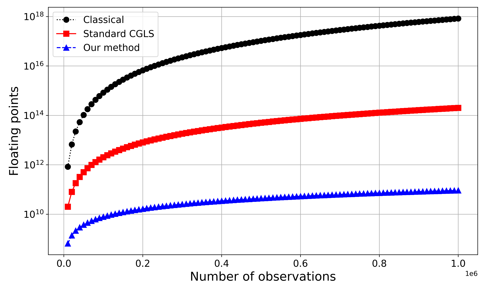
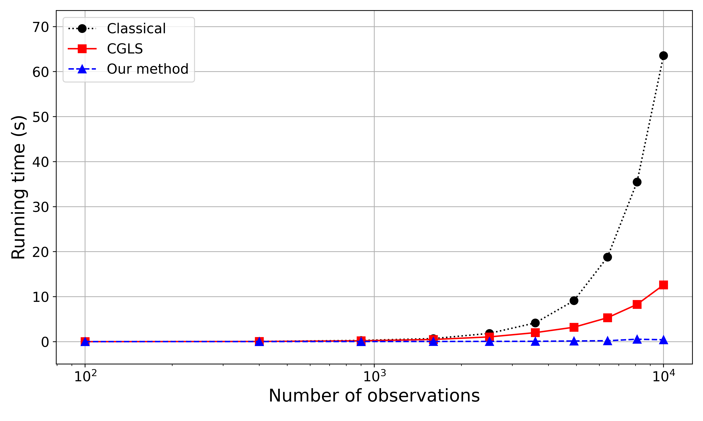

# Convolutional equivalent layer for magnetic data processing

by
[Diego Takahashi](http://www.pinga-lab.org/people/tomazella.html)1,
[Vanderlei C. Oliveira Jr.](http://www.pinga-lab.org/people/oliveira-jr.html)1 and
[Valéria C. F. Barbosa](http://www.pinga-lab.org/people/oliveira-jr.html)1

1[Observatório Nacional](http://www.on.br/index.php/pt-br/)

This work was submitted for publication in
[*Geophysics*](https://seg.org/Publications/Journals/Geophysics).

## Abstract

We present a fast equivalent layer method for processing large-scale magnetic data. 
We demonstrate that the sensitivity matrix associated with an equivalent layer
of dipoles can be arranged to a Block-Toeplitz Toeplitz-Block (BTTB) structure for the 
case in which observations and dipoles are aligned on a 
horizontal and regularly-spaced grid.
The product of a BTTB matrix and an arbitrary vector represents a discrete 
convolution and can be efficiently computed via 2D Fast Fourier Transform.
In this case, the matrix-vector product uses only the elements forming the first column
of the BTTB matrix, saving computational time and memory. 
Our convolutional equivalent layer method uses this approach to compute 
the matrix-vector products in the iterative conjugate gradient algorithm with the purpose 
of estimating the physical-property distribution over the equivalent layer for 
large data sets.
Synthetic tests with a mid-size 100x50 grid of total-field anomaly data
show a decrease of approximate 4 orders of magnitude in floating-point operations and approximate 25x 
in computation runtime of our method compared to the classical approach of solving
the least-squares normal equations via Cholesky decomposition. 
Faster results are obtained for millions of data, showing drastic decreases in RAM usage
and runtime, allowing to perform magnetic data processing of large data sets on regular 
desktop computers. 
Our results also show that, compared to the classical Fourier approach, the magnetic
data processing with our method requires similar computation time, but produces significantly 
smaller border effects without using any padding scheme and also is more robust to 
deal with data on irregularly spaced points or on undulating observation surfaces.
A test with 1,310,000 irregularly spaced field data over the Carajás Province, Brazil, 
confirms the efficiency of our method by taking approximate 385.56 seconds to estimate the physical-property
distribution over the equivalent layer and approximate 2.64 seconds to compute the upward 
continuation.

**Figure 1:** *Number of flops associated with classical method, 
the standard CGLS method and our method, all of them with 50 iterations. 
The number of observation points $N$ varies from 5,000 to 1,000,000.*

**Figure 2:** *Comparison between the runtime of the equivalent-layer technique using the classical method, 
standard CGLS method and our method. The values for the standard CGLS and our method use 50 iterations.*

## Reproducing the results

You can download a copy of all the files in this repository by cloning the
[git](https://git-scm.com/) repository:

    git clone https://github.com/DiegoTaka/EQ_Layer_Mag-Toeplitz.git

All source code used to generate the results and figures in the paper are in
the `code` folder. The sources for the manuscript text and figures are in `manuscript`.
See the `README.md` files in each directory for a full description.

The calculations and figure generation are all run inside
[Jupyter notebooks](http://jupyter.org/).
You can view a static (non-executable) version of the notebooks in the
[nbviewer](https://nbviewer.jupyter.org/) webservice:

http://nbviewer.jupyter.org/github/pinga-lab/Eq_Layer-Toeplitz

See sections below for instructions on executing the code.

### Setting up your environment

You'll need a working Python **3.8** environment with all the standard
scientific packages installed (numpy, scipy, matplotlib, etc).  The easiest
(and recommended) way to get this is to download and install the
[Anaconda Python distribution](http://continuum.io/downloads#all).
Make sure you get the **Python 3.8** version or above.

Use `conda` package manager (included in Anaconda) to create a
[virtual environment](https://conda.io/docs/using/envs.html) with
all the required packages installed.
Run the following command in this folder (where `environment.yml`
is located):

    conda env create

To activate the conda environment, run

    source activate bttb

or, if you're on Windows,

    activate bttb

This will enable the environment for your current terminal session.
After running the code, deactivate the environment with the following
commands:

    source deactivate

or, if you're on Windows,

    deactivate

**Windows users:** We recommend having a bash shell and the `make` installed
to run the code, produce the results and check the code. You may download the
[*Git for Windows*](https://git-for-windows.github.io/) and the
[*Software Carpentry Windows Installer*](https://github.com/swcarpentry/windows-installer/releases).

### Running the code

To execute the code in the Jupyter notebooks, you must first start the
notebook server by going into the repository folder and running:

    jupyter notebook

Make sure you have the `conda` environment enabled first.

This will start the server and open your default web browser to the Jupyter
interface. In the page, go into the `code` folder and select the
notebook that you wish to view/run.

The notebook is divided into cells (some have text while other have code).
Each cell can be executed using `Shift + Enter`.
Executing text cells does nothing while executing code cells runs the code
and produces it's output.
To execute the whole notebook, run all cells in order or use "Cell -> Run All"
from the menu bar.

## License

All source code is made available under a BSD 3-clause license.  You can freely
use and modify the code, without warranty, so long as you provide attribution
to the authors.  See `LICENSE.md` for the full license text.

The manuscript text is not open source. The authors reserve the rights to the
article content.